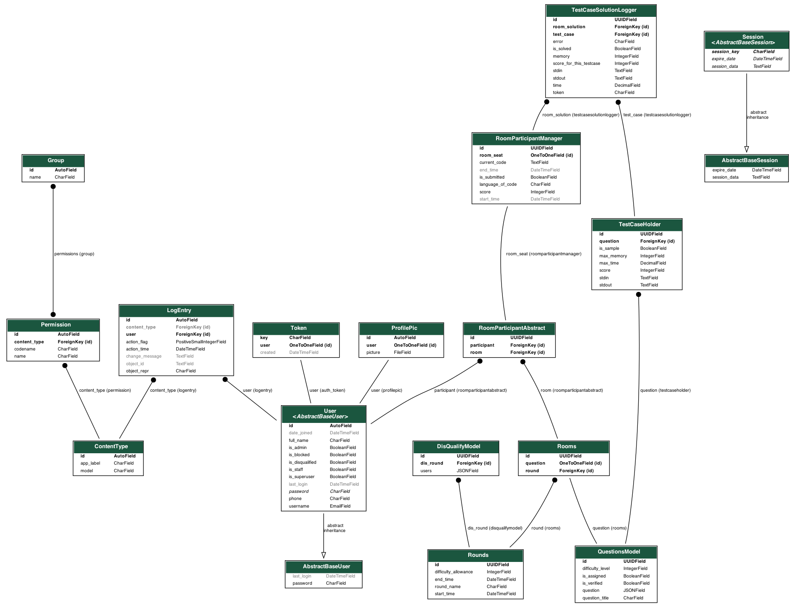

<p align="center">
<a href="https://dscvit.com">
	
</a>
	<h2 align="center"> KnockOuts Backend </h2>
	<h4 align="center"> A Competetive Coding Portal Backend  <h4>
</p>

---
[](https://documenter.getpostman.com/view/8653133/T17Nbjz8) 
  [](https://knockouts.dscvit.com/)

#####Link for Forntend Repo : <a href="https://github.com/GDGVIT/competitive-edge-web">Knockouts-Frontend</a>

## Functionalities
- [x]  Run Code
- [x]  Submit Code
- [x]  Check Score
- [x]  Auto Assign Rooms
- [x]  Create Rounds
- [x]  Adding multiple members to room
- [x]  Disqualify and qualify people automatically
- [x]  Google and Github OAUTH

<br>

## Database ER Diagram


## Instructions to run

* Pre-requisites:
	-  Docker
	-  Python
	-  GOOGLE RECAPTCHA SETUP
	-  Firebase Project for Authentication
	-  JudgeAPI Self Deployed server for Run and Submit Code

* Directions to install
    - Place your Firebase Config file in app dir as knockoutsfb.json
    - Deploy <a href="https://api.judge0.com/">Judge API</a>
    - Navigate to ```traefik.toml``` file and configure domain and email. For changing default password <a href="https://docs.traefik.io/middlewares/basicauth/#general">check this out</a>
    - Before deploying configure DNS with a CNAME Address pointing to the server's IP. By default Traefik is configured to HTTPS.
    - For running in localhost ignore the above two steps
    - Fill your Frontend Host Details in ```settings.py``` file for CORS.
    - Fill all your env variables using the below commands.
    - Use ```test_case_tester.py``` file to test uploaded testcases.
    - Use ```questions.ipynb``` file to replicate questions and testcases
```bash
cp example.env .env
nano .env 
```

* Directions to execute

```bash
docker-compose build
docker-compose up -d
docker exec -it traefik sh
chmod 600 acme.json
```
After this step Traefik will request for SSL Certificate and it will be stored in ```acme.json``` file

## Contributors

<table>
<tr align="center">


<td>

Sai Sandeep Rayanuthala<br><br>
```Backend ```
<p align="center">

</p>
<p align="center">
<a href = "https://github.com/raysandeep/"></a>
<a href = "https://www.linkedin.com/in/sai-sandeep-r/">

</a>
</p>
</td>

<td>

Amogh Lele<br><br>
```Deployment ```


<p align="center">

</p>
<p align="center">
<a href = "https://github.com/ATechnoHazard"></a>
<a href = "https://www.linkedin.com/in/amogh-lele-830131a4/">

</a>
</p>
</td>


</tr>
  </table>

<br>
<br>

<p align="center">
	Made with ♥️ by <a href="https://dscvit.com">DSC VIT</a>
</p>
